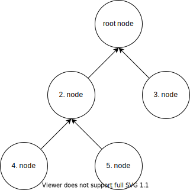
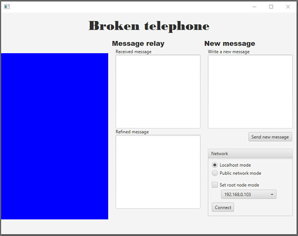

# Broken telephone

## Distributed Software Systems 2021 Exercise 2 Assignment

In the second assignment we will be practicing establishing and managing network connections. Threads play a large role in networking as well. The assignment will be done using the provided program skeleton: you will implement missing the parts of the program.

Telephone game utilizes JavaFX library to provide the graphical user interface. Knowledge on JavaFX is not required to complete the exercise though.

The project template is a Maven project (https://maven.apache.org/). You do not need to configure the Maven project yourself but using the provided Maven configuration is required: the submission must compile and run using Maven command line interface.

## Topic and Description

The topic for the second exercise is ["broken telephone"](https://en.wikipedia.org/wiki/Chinese_whispers) also known as "telephone game" or "Chinese whispers" in English. The rules for traditional broken telephone are simple: We need a bunch of people standing in line-like formation. The first person on the line whispers a word or a sentence to the person next to them. This person relays the whisper to the person next to him/her and so on. Due to not hearing the sentence perfectly or just deliberately altering it, the message changes along the way and it may not sound anything like in the beginning when it finally reaches the end of the line.

In this exercise the traditional broken telephone will be upgraded to the "network-age" by using a peer-to-peer networking architecture. Instead of people whispering to each other, we have applications communicating and relaying messages over TCP sockets. As the application works on peer-to-peer principle, it contains both, the client and server components to communicate with other *peers*. On more practical level the idea is that every peer connects to an existing peer on the network using TCP sockets. Whenever a peer wants to send a message to other peers, it will send the message to its *neighbours*, i.e. the peers that are directly connected to it. The neighbours will then relay the message to their neighbours and so on, until the message has propagated to all the peers in the network. Obviously, because the game is called **broken** telephone (at least in Finnish), every peer can alter the message before it relays it forward.

The difference between our version of the broken telephone and the traditional one is that the "phone line" is not just a simple one-dimensional line where the message is sent from the previous peer to the next one. The peer can have multiple neighbours: the peer itself has most likely connected to another peer (if it is not the first peer on the peer network), and on the contrary, multiple other peers could have connected to our peer as well. From this follows that there can be multiple different mutations of the same message depending on the route the message took in the peer network.

There exists a ready-made component in the project template that helps to discover the peers on the network (more on this when talking about "Resolver" class). When a new peer wants to connect to the network, the Resolver will offer an IP address of an existing peer that our peer can connect to. The Resolver has been designed to offer IP addresses in a way that the peers will connect to each other in a binary tree -like formation (see the figure). When a peer ("node") in the binary tree wants to send a message, it will send it to all its neighbours who in turn modify the message and forward it to their neighbours.

In the binary tree graph above, the peers are depicted as nodes. To get an idea of how messages propagate in network, let us take an example. If the node 2 wanted to send a message to other nodes, it would send the message to all its neighbours: node 4, node 5 and the "root node" (node 1). The root node would tamper the message and then relay it to the node 3. For second example, if node 3 would like to send a **new** message, it would first send it to its only neighbour, the root node. The root node would modify the message and forward it to node 2. Node 2 would make its own modifications to the message and forward it to the nodes 4 and 5. This way the message would be eventually propagated to all the peers in the network, slightly modified that is. Please note that the arrows in the graph do **not** denote the direction of messages. It denotes who has connected to whom.

**Hint:** The most observant among you might have already seen a problem in the previous example: if the received message is forwarded to all the neighbours, it will be sent back to the sender as well. This would mean that the sender would again resend the message and the message would be indefinitely traveling in the network. The messages will have an ID field that can be used to compare the received messages to "seen" messages, thus eliminating these ghost messages.

## Program usage and interface

The colorful area on the left side of the window depicts the progress of the message in the network. The color of the box will be red for the original sender of the message. As the message progresses in the network, the color changes gradually from red to blue for each node that receives and modifies the message.

The *received* and *refined* text areas in the middle column of the application show the received message contents before and after the current node has modified it. *Write new message* field can be used to send a new message along with the self-explanatory *Send new message* button.

### Network options
Before any messages can be sent, received or forwarded we need to connect to an existing peer in the network or at least wait for another peer to connect us: playing broken telephone alone gets old rather fast.

There are two distinct connection modes available: *localhost mode* and *public network mode*. If localhost mode is selected, the communication between peers happens within the ports of a single computer. This mode rather handy for developing and testing the application using just a single computer. If *public network mode* is selected, the communication will happen between different hosts all having their own IP address and thus requires multiple computers. Please note that the public network mode works only when the computers are in the same subnet. It will not work over the Internet for example.

The "broken telephone network" must have a single root node that will not connect to other peers; basically the first peer that has no-one other to connect to. The peers connecting after the root node will always have somebody to connect to, at least the root node. In addition to being the first node, the root node has another important role: it distributes the IP addresses and ports for the new peers to connect to. This functionality comes with the project template out-of-box, no need to implement it yourself (More about this in Resolver chapter)! The peer network requires one (and only one) root node to function. When starting a node as a root node, you must select the IP address where the application is reachable by the other nodes.

### Usage
You need to run multiple instances of the application running either by using the localhost mode within a single computer or multiple computers by using public network mode. One of the instances will be assigned as *root node*. The network will start by pressing "Connect" button: the root node should start listening for other peers.

After starting up the root node the rest of the peers can be connected to the network by pressing the connect button. The user does not need to know which node one should connect to. The provided Resolver will return IP address and port number for the application to connect to. Remember that every peer that connects the network, should also listen and accept new connection requests from other peers: this is a peer-to-peer application after all.

## Program structure and description

### App.java ja fi.utu.tech.telephonegame.ui pakkaus

App.java is the main class of the program. It includes the main method as well as method calls to start some of the services. The UI package contains the classes related to the graphical user interface.

These classes should not be modified.

### Gui_io.java

Gui_io works as the connecting piece between JavaFx UI and other parts of the program. This class should not be modified.

### Refiner.java

The Refiner class contains methods that will modify the received messages before forwarding. Feel free to modify the message-modifying function as you please, as long as it is nothing inappropriate.

### Message.java
Contains the message, the "color" of the message as well as methods to modify them. Every Message has got their unique ID. Message objects are used with Envelope objects (from network package) to send messages over the network. Please note that the Message class implements the Serializable interface!

### MessageBroker.java
MessageBroker transports messages between different parts of the program. For example it will relay the Message objects it receives from the network component to other components such as the UI and Refiner. Finally it will could send the message back to the network by using the network component.

### fi.utu.tech.telephonegame.network package
This package includes everything related to networking. Most of the development is done here.

### Resolver
Resolver can be considered the "dating service" for the peers as it handles adding new peers to the network in a way that the resulting network structure resembles a binary tree. The inner working of this class is as follows: When a peer is connected in "root node" mode, the Resolver starts a thread that listens for peer discovery requests. The requests can be sent by calling the `resolve()` method. When a newly created node calls its `resolve()` method, the root node will notice this. Under the bonnet, the resolve method sends an UDP packet to the broadcast address and the root node catches this packet. This way there is no need to specify the root node IP address as long as every node is the same subnet.

The root node will respond to the peer discovery request by sending the caller an IP address and port of a node that is already connected to the peer network (this way the root node can control the structure of the resulting network). The new node will connect to the network via this received IP address and port. The root node will save the IP address of the newly joined node for future use; the address can be sent as a response for future peer discovery requests.

It is good, albeit not necessary to complete the exercise, to understand how the resolver works as it is tightly related to the course topics. To be able to use the Resolver as a part of the exercise, it is enough to understand that to create a TCP connection to a node, we need to get its IP address. Resolver is created for this purpose.

This class should not be modified.

### Envelope

Envelope, as its name suggests, is the "envelope" for the data transmitted in the peer-to-peer-network. It carries the payload, which in case of this application is always a Message object, but in theory we could send any objects using the Envelope. In addition to the payload, Envelope contains an identifier.

Hint: The Envelope ID can be used to prevent the problem of "ghost messages" described earlier: If an envelope with a previously seen id is received again, we might as well trash the envelope and not forward it...

### NetworkService
NetworkService implements the Network interface defined in the package. NetworkService as-is contains methods to manage the resolver, but it should contain also a lot more methods (by you). These methods could, to mention a few, make it possible to start listening for new peers, connect to an existing peer and send messages to the network. It should go without saying that most of the development will be done in class. Do note that you most probably need to create additional classes to the Network package as well.

## Assignment

- Implement the "peer-to-peer" networking functionality for the program
	- The application should be able to send and receive objects wrapped in Envelope objects to/from neighbours. Neighbours mean the peers that are directly connected to you or you have directly connected to.
	- Use TCP sockets, ObjectOutputStream and ObjectInputStream
	- The modifications are done to the NetworkService class. You will also need to write few new classes by yourself.
- Implement the methods in MessageBroker that allow you to get messages from the network component. Process the received Message object so that
	1) The received message and color will be refined in Refiner
	2) The received and refined message both are shown in the GUI
	3) The refined message is forwarded to the neighbours with the network component
- Edit the message-modifier method of the Refiner to your liking
	- Feel free to come up with your own ideas on how the messages are modified. Please note that only the message contents should be modified, not the Message class for example.
- Note, the network does not have to recover if one of the nodes go missing. We assume that every node that ever connects will be connected for eternity
