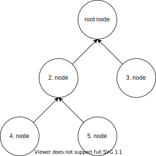
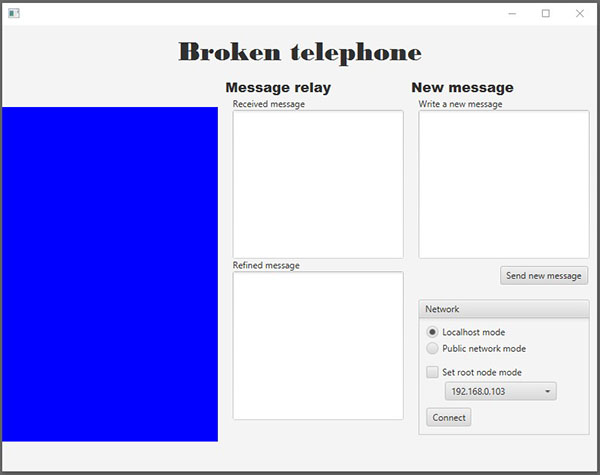
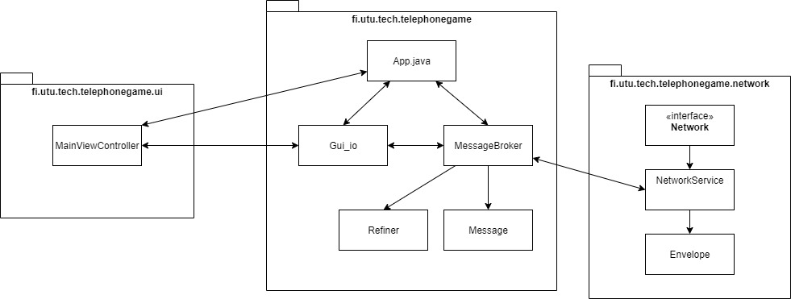

# Broken telephone 

## Hajautetut ohjelmistojärjestelmät 2021 harjoitustyö 2 tehtävänanto

Toisessa harjoitustyössä harjoitellaan verkkoyhteyksien muodostamista ja käyttöä. Myös säikeitä harjoitellaan lisää. Harjoitus pohjautuu valmiiseen ohjelmarunkoon, johon ryhmän tehtävänä on täydentää puuttuvat osat. 

Telephonegame käyttää JavaFx-ympäristöä graafisen käyttöliittymänsä toteutukseen. Harjoitustyön tekemiseen ei kuitenkaan tarvita JavaFx osaamista.

Työn pohja on Maven-projekti (https://maven.apache.org/). Kurssilla ei vaadita Maven osaamista, mutta sen käyttö on pakollista. Palautettavan version on käynnistyttävä oikein komentoriviltä Mavenia käyttäen. 

### Tehtävän aihe ja kuvaus

Toisen työn aiheena on rikkinäinen puhelin. Perinteisen rikkinäisen puhelimen säännöt ovat melko selkeät: tarvitaan joukko ihmisiä jonomaisessa muodostelmassa. Jonon alkupäässä oleva henkilö keksii sanan tai lauseen. Tämä lause välitetään jonon toiseen päähän kuiskaamalla se aina seuraavan henkilön korvaan. Viesti saattaa muuttaa muotoaan matkalla joko väärintulkinnan tai jonon jäsenien mielikuvituksen vuoksi.

Tässä työssä rikkinäinen puhelin tuodaan nykyaikaan vertaisverkkopohjaisella ratkaisulla, jossa ihmiset on korvattu ohjelmilla, jotka kommunikoivat toisillensa TCP-verkkosokettien yli välittäen viestejä edelleen. Koska ohjelmat toimivat vertaisverkkoperiaatteella, on samassa ohjelmassa niin palvelintoiminnallisuus, kuin sen asiakaspuolikin. Tällaisia ohjelmia kutsutaan vertaisverkoissa *vertaisiksi*. Tarkemmin ideana on, että jokainen käynnissä oleva vertainen yhdistää toiseen vertaiseen käyttäen TCP-soketteja. Kun joku vertaisista päättää lähettää viestin muille vertaisille, välitetään se tämän naapureille, eli vertaisille, jotka ovat suoraan yhteydessä viestiä lähettävään vertaiseen. Naapurit puolestansa välittävät viestin omille naapureilleen, kunnes viesti on propagoitunut kaikille vertaisille. Toki, koska kyseessä on **rikkinäinen** puhelin, jokainen vertainen saa luvan muokata lähetettyä viestiä haluamallaan tavalla ennen edelleenlähetystä.

Erona kuitenkin perinteiseen rikkinäiseen puhelimeen on se, ettei "puhelinlinjana" toimi yksinkertainen suora jono, jossa viesti kuljetetaan edelliseltä seuraavalle. Vertaisella voi olla useita naapureita: vertainen itse on luultavasti yhdistänyt johonkin toiseen vertaiseen (ellei tämä ole ensimmäinen verkossa) ja tämän lisäksi useampi vertainen on saattanut yhdistää itsensä kyseiseen vertaiseen. Näin ollen viesti saattaa mutatoitua eri tavoin eri suuntiin kulkiessa.

Harjoitustyöpohjassa on mukana komponentti, joka auttaa vertaisten IP-osotteiden selvittämisessä (tästä lisää Resolver-luokkaa kuvatessa). Tämä komponentti on rakennettu siten, että vertaisten yhdistäessä toisiinsa komponentin tarjoamien IP-osotteiden perusteella, muodostavat vertaiset binääripuuta muistuttavan rakenteen (ks. kuva). Kun binääripuussa jokin solmu päättää lähettää viestin, lähettää se viestin kaikille naapureilleen, jotka puolestansa muokkaavat viestiä ja lähettävät viestin eteenpäin omille naapureilleen.

Esimerkiksi yllä olevassa binääripuugraafissa, jossa vertaiset on kuvattu solmuina, mikäli 2. solmu päättäisi lähettää uuden viestin muille solmuille, lähettäisi se viestin kaikille naapureilleen: solmu 4:lle, solmu 5:lle sekä juurisolmulle (1. solmu). Juurisolmu muokkaisi viestin haluamakseen ja edelleenlähettäisi sen solmulle 3. Jos taas solmu 3 päättäisi puolestansa lähettää **uuden** viestin, lähettäisi se sen ensin ainoalle naapurillensa, juurisolmulle, joka puolestansa lähettäisi viestin (muuteltuna) 2. solmulle, joka puolestansa tekisi omat muutoksensa ja lähettäisi muutetun viestin solmuille 4 ja 5. Tällä tavoin viesti propagoituisi ympäri verkkoa solmulta toiselle aina hieman muuttuen. Huomaa, että kuvassa nuolet **eivät** tarkoita, mihin suuntaan viestejä lähetetään, vaan sitä, mikä solmu on yhdistänyt mihinkin solmuun (ts. asiakas -> palvelin -suhde).

**Vinkki:** Tarkkaavaisimmat saattavat myös huomata erään ongelman edelläkuvatussa viestinvälityksessä: mikäli vastaanotettu viesti edelleenlähetetään kaikille naapureille, palautuu se myös lähettäjälle itselleen, jolloin viesti lähetetään jälleen kaikille. Tästä seuraa se, että viesti saattaa jäädä kiertämään verkkoon ikuisesti. Tämän vuoksi viestien mukana lähetetään ID-arvo, jota vertaamalla "nähtyihin" viesteihin, voidaan estää saman viestin kummittelu verkossa.

## Ohjelman käyttöliittymä ja käyttö

Käyttöliittymän vasemmassa laidassa oleva värialue kuvaa viestin etenemistä verkossa. Uuden viestin lähettäjällä ruutu muuttuu punaiseksi ja viestin edetessä verkossa jokaisen verkon solmun väri eroaa edellisestä solmusta muuttuen värispektissä asteittain kohti sinistä.

Ikkunan keskimmäisen sarakkeen *received* ja *refined* tekstialueet näyttävät verkosta saapuneen viestin sisällön ennen ja jälkeen kyseisen verkon solmun tekemää muutosta. Mikäli verkkoon haluaa lähettää uuden viestin, tulisi sen onnistua *Write New Message*-kohtaan kirjoittamalla ja *Send new Message*-nappia painamalla.

### Network-valinnat
Ennen kuin viestejä voi lähettää, vastaanottaa tai edelleenlähettää, tarvitsee ohjelma yhdistää toiseen käynnissä olevaan ohjelmaan tai vähintäänkin odottaa toisen ohjelman liittymistä: rikkinäisen puhelimen pelaaminen yksinään käy ajan mittaan tylsäksi.

Ohjelmarungossa on kaksi erilaista tilaa: *localhost mode* ja *public network mode*. Jos valintana on *localhost*, liikennöinti tapahtuu oman koneen eri porttien välillä. Tämä tila sopii testaukseen kehitettäessä ohjelmaa yhdellä koneella. *Public network modessa* liikennöinti tapahtuu eri IP-osotteiden välillä, samaa porttia kuunnellen ja vaatii usean erillisen koneen käyttöä. Se toimii vain yhden aliverkon alueella, eikä toimi tämän vuoksi esim. julkisen internetin yli. 

"Rikkinäisessä puheliverkossa" täytyy olla myös yksi juurisolmu, joka ei ole itse yhdistäytynyt itseään muihin vertaisiin; eli siis ensimmäinen vertainen, johon seuraavat vertaiset voivat yhdistää. Juurisolmulla on ohjelmarungossa myös toinen tärkeä tehtävä: se ohjaa verkon toimintaa jakamalla IP-osoitteet ja portit, joihin uudet solmut voivat yhdistää. Tämä toiminnallisuus on mukana tehtäväpohjassa, eikä sitä siis tarvitse itse implementoida (asiasta lisää Resolver-kohdassa). Kun testaatte ohjelmaanne, yhden (ja vain yhden) koneen täytyy toimia juurisolmuna. Juurisolmua luodessa pitää alasvetovalikosta *public network modessa* valita myös IP-osoite, josta koneesi on tavoitettavissa.

### Käyttö

Ohjelmasta käynnistetään samanaikaisesti useita instansseja joko samaan koneeseen käyttäen *localhost* moodia tai useampaan koneeseen *public network* moodissa. Vain yksi ohjelmainstansseista asetaan juurisolmuksi, eli root node -tilaan. Verkko käynnistään painamalla *Connect*-nappia. Tällöin (valmiin) ohjelman tulisi alkaa odottamaan, että toiset vertaiset yhdistävät tähän.

Juurisolmun käynnistämisen jälkeen muut käynnissä olevat ohjelmat voidaan yhdistää verkkoon connect-nappia painamalla. Resolverin ansiosta käyttäjän ei tarvitse tietää, mihin vertaiseen hänen pitää yhdistää: Resolver antaa IP-osoitteen ja portin, johon ohjelma voi yhdistää. Koska kyseessä on vertaisverkko-ohjelmisto, täytyy myös jokaisen yhdistäneen vertaisen kuunnella yhteyspyyntöjä toisilta vertaisilta.

## Ohjelman rakenteen kuvaus

### App.java ja fi.utu.tech.telephonegame.ui pakkaus

App.java on ohjelman pääluokka, joka sisältää main-metodin, sekä joidenkin palveluiden käynnistyksen. Pakkaus UI sisältää graafiseen käyttöliitymän toimintaan liittyvät luokat.

Näitä luokkia ei harjoitustyössä saa muuttaa, eikä niitä käytetä työssä suoraan.

### Gui_io.java

Gui_io on linkki JavaFx-käyttöliittymän ja ohjelman muiden osien välillä. Tätä luokkaa ei pidä muuttaa.

### Refiner.java

Refiner-luokassa on metodit, joihin voidaan määrittää, miten vastaanotettujen viestien tekstisisältöä voidaan muuttaa ennen edelleenlähetystä. Voit keksiä omia muuntofuktioitasi vapaasti, kunhan ne noudattavat hyvää makua.

### Message.java

Sisältää välitettävän viestin, sekä viestin "värin", sekä metodit näiden muokkaamiseksi. Jokaisella viestillä on myös oma ID-tunnisteensa. Message-luokan olioita käytetään yhdessä Envelope-luokan olioiden kanssa viestin välittämiseen verkon yli. Huomaa, että Message.java implementoi Serializable-rajapinnan!

### MessageBroker.java
MessageBrokerin, eli viestinvälittäjän tarkoituksena on välittää verkkoluokan (Network) vastaanottamat Message-oliot ohjelman eri komponenteille, kuten käyttöliittymälle, Refinerille, sekä Refireniltä saadut, muokatut viestit, takaisin verkkokomponentille edelleenlähetettäviksi.

### fi.utu.tech.telephonegame.network pakkaus
Tämä pakkaus sisältää kaiken verkkoon liittyvän toiminnallisuuden. Suuri osa työstä tehdään tämän pakkauksen alle.

### Resolver
Resolver-luokkaa voidaan pitää solmujen "treffipalveluna", sillä se hoitaa uusien solmujen sovittamisen verkkoon siten, että muodostuva verkkorakenne muistuttaa binääripuuta. Toiminta yksinkertaistetusti on seuraavanlainen: Solmun ollessa juurisolmu, käynnistyy Resolver-luokassa säie, joka kuuntelee vertaishakupyyntöjä, joita puolestaan pystyy tekemään saman luokan `resolve()`-metodilla. Kun uusi solmu kutsuu resolve-metodiansa, saa juurisolmu tästä tiedon. Kommunikaatio tapahtuu UDP-soketeilla broadcast-osoitteeseen, joten juurisolmua etsivän solmun ei tarvitse tietää juurisolmun osoitetta. Juurisolmu vastaa uudelle säikeelle antamalla tälle jonkun verkossa olevan solmun IP-osoitteen, johon solmu voi itsensä yhdistää (samalla luoden binääripuumaisen rakenteen verkolle). Samalla se nappaa resolvausta pyytäneen solmun IP-osoitteen talteen, jotta voi tulevaisuudessa antaa sen jollekin toiselle solmulle yhdistämiskohteeksi.

Kurssin aiheiden kannalta on hyvä selvittää, miten resolver toimii, mutta sen sisäisen logiikan ymmärtäminen ei ole keskeistä harjoitustyön tekemiseksi. Oleellista on ymmärtää, että luodakseen TCP-yhteyden johonkin solmuun, täytyy sen IP-osoite selvitää. Resolver on luotu tätä tarkoitusta varten.

Resolveriin ei tule tehdä muutoksia.

### Envelope

Envelope on nimensä mukaisesti vertaisverkossa lähetettävän sisällön "kirjekuori". Se sisältää itse hyötykuorman (payload), joka on käytännössä tätä ohjelmaa ajatellen lähes aina *Message*-luokan olio. Envelope ei kuitenkaan teoriassa ota kantaa siihen, mitä sen sisällä kuljetetaan. Hyötykuorman lisäksi Envelope sisältää metatietona kirjekuoren yksilöllisesti identifioivan id-tunnisteen. 

Vinkki: Kirjekuoren id-tunnistetta pystyy käyttämään edelleenlähetyksen estoon: mikäli samalla id-tunnisteella merkattu kirjekuori vastaanotetaan uudelleen, sen voinee heittää roskiin...

### NetworkService
NetworkService toteuttaa samassa pakkauksessa sijaitsevan Network-rajapinnan. NetworkService sisältää valmiiksi Resolverin käyttöön liittyviä metodeita, mutta sen tulisi sisältää myös muita metodeita. Näillä metodeilla voisi esimerkiksi alkaa kuuntelemaan vertaisien yhteydenottopyyntöjä, yhdistää toiseen vertaiseen tai lähettää viestejä vertaisille. Sanomattakin selvää, että tämän luokan kirjoittaminen on suuri osa työtä. Lisävinkkinä, network-pakkaukseen tarvitsee luultavasti kirjoittaa myös uusia luokkia.

## Tehtävä

- Toteuttakaa ohjelmaan verkkotoiminnallisuus
	- Verkkotoiminnallisuuden tulee osata lähettää ja vastaanottaa Envelope-olioihin käärittyjä olioita vertaisen naapureille (eli siis niille, jotka ovat vertaiseen suoraan yhdistäneet, sekä sille, johon vertainen on itse yhdistänyt)
	- Käyttäkää TCP-soketteja, sekä ObjectOutputStreamia ja ObjectInputStreamia
	- Muutokset tehdään NetworkService-luokkaan, sekä omiin tarpeellisiksi näkemiinne uusiin luokkiin
- Toteuttakaa MessageBrokerin metodit, jolla saatte Network-komponenttinne verkosta vastaanottamat oliot MessageBrokerin puolelle ja käsitelkää vastaanotetut Message-oliot siten, että
	1) Viesti ja väri muokataan Refinerissä
	2) Vastaanotettu viesti sekä muokattu viesti ja väri näkyvät käyttöliittymässä
	3) Muokattu viesti lähetetään eteenpäin naapurivertaisille
- Toteuttakaa Refiner-luokan viestinmuutosmetodi mutatoimaan viestien tekstisisältöä
	- Mielikuvitusta saa käyttää! Huomatkaa, että tarkoitus on mutatoida viestisisältöä, ei itse Message-olioita.	
- Ohjelman ei tarvitse osata toipua tilanteesta, jossa jokin vertaisista tippuu pois välistä.
